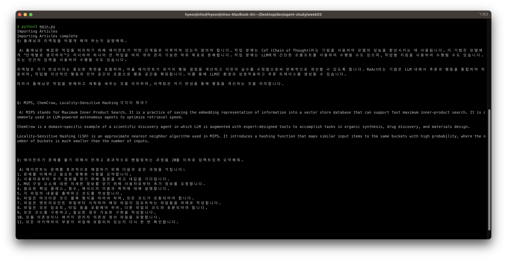

# Week 03. Retreival: Domain Expert

## 결과

## 환경변수 설정

`$ export OPENAI_API_KEY=<API_KEY>`

## 실행 방법

- weaviate local 구동: `$ docker-compose up -d`
- 파일 실행: `$ python main.py`

## 학습 내용

> 과제를 진행하며, 아래 내용에 대해 학습하였습니다.

- embedding의 개념을 이해합니다.
  - 내용을 벡터화 하여 자연어를 기계어로 변환.
  - 이번 과제에서는, 문서와 질문 간의 상관관계를 계산하기 위해, 임베딩이 필요
- short-term memory와 long-term memory를 나눠서 관리하기 시작합니다.
  - long term memory
    - 문서들의 임베딩을 미리 연산해두는 것. 이 값들을 영구 저장소(파일 혹은 vector db 등)에 저장해두고, 질문이 들어올 때는 이 영구 저장값을 기반으로 답을 반환
    - embedding을 미리 할 수도 있으나, weaviate에 이 역할을 위임. (https://weaviate.io/developers/weaviate/modules/retriever-vectorizer-modules/text2vec-openai)
  - short term memory
    - 입력된 질문의 임베딩을 연산

## 요구사항

> 요구사항 중 아래 사항들을 충족한 방식을 서술합니다.

- request 한 번에 8K 토큰이 안 넘어야 합니다.
  - openai 호출시 토큰을 조절해야 하는 경우는 질문의 임베딩 연산
    - 질문에 필요한 배경지식을 가져올 때, 토큰이 넘지 않는 최대한으로 가져오도록 함
- 글에서 3군데 이상 봐야 대답할 수 있는 복잡한 질문을 했을 때 스스로 생각하면서 여러 번 검색할 수 있도록 합니다.
  - RAG를 수행하는 Generative Search를 적용
    - https://weaviate.io/developers/weaviate/search/generative
    - https://weaviate.io/developers/weaviate/modules/reader-generator-modules/generative-openai
